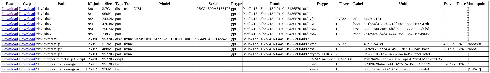

# blockdevice-downloader

This project builds a bootable Debian image with the purpose to be put on USB flash drive.

On boot, a HTTP server is started and serves all block device files as downloadable files.

Example at http://localhost:8090



Download raw image or gzipped image by clicking the links. Or use curl:
```
$ curl -OJ http://localhost:8090/download?file=%2fdev%2fsda
```

## Usage

Run `make` and copy the image `blockdevice-downloader_bookworm-amd64.img` to a USB flash drive with `dd` or `bmaptool`.
